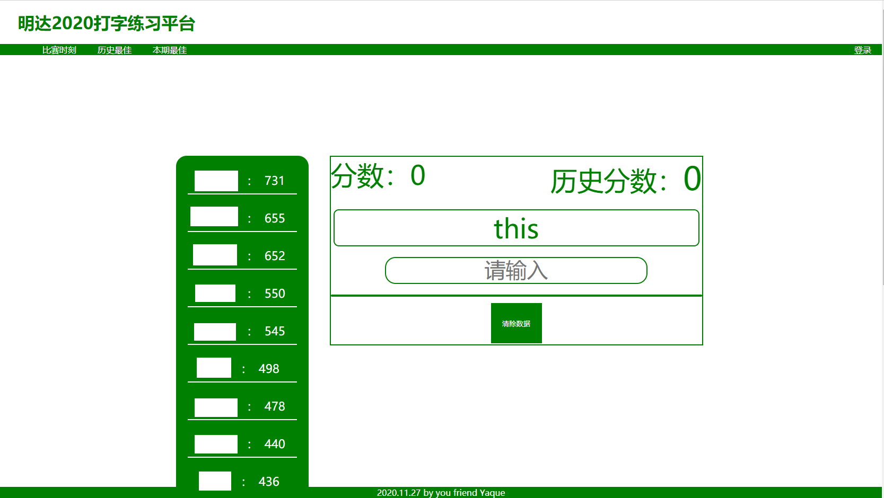

# PrintWord
打字练习平台

当前版本是使用python3+flask+jquery框架搭建
## 实例图片

## 使用
1.首先使用create_sqlite.py生成sqlite数据库
2.然后正常运行即可

具体步骤：

    pip install Flask
    python3 create_sqlite.py
    python3 app.py
    
默认可以在局域网内访问。

## 平台支持
1.理论上支持任何可运行flask的平台

## 建议
1.服务器部署建议使用nginx

## 声明
1.一切都是随意写的，只用于局域网比赛考试使用，未经过大型生产环境使用，对于未知后果一概不负责认。
2.任何使用请网站尾部加上yaque标识。
